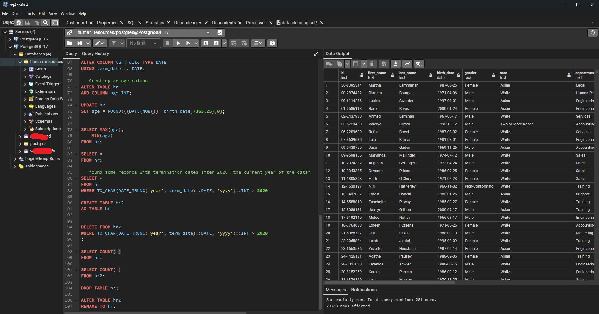
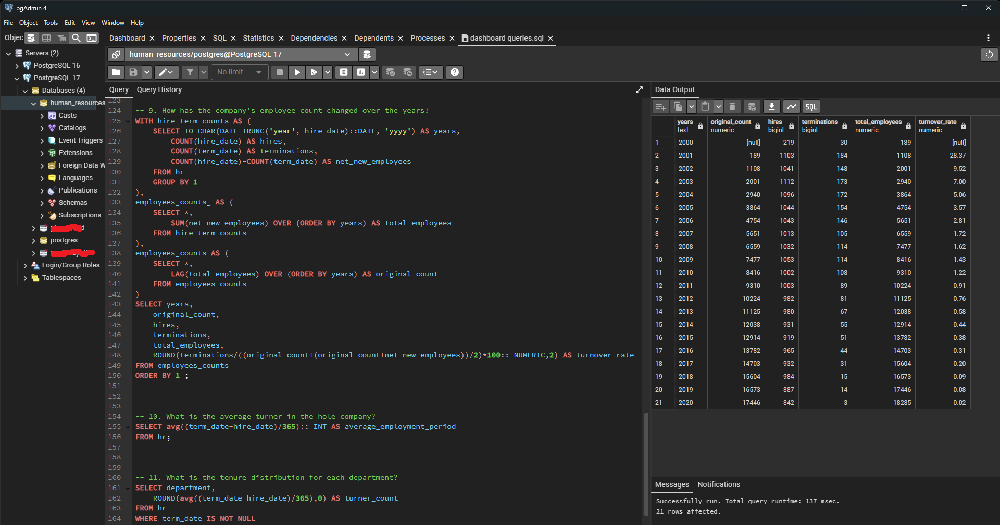

# HR Data Analysis Project  

 *Replace with a banner image if desired*

## 📋 Overview  
This project analyzes employee distribution, turnover, and hiring trends for a company from 2000–2020. The goal is to evaluate HR performance, identify retention risks, and uncover demographic patterns.  

---

## 📁 Data  
- **Dataset**: 22,000+ rows of HR records (2000–2020).  
- **Key Columns**: Employee location, gender, age, ethnicity, job title, department, tenure, turnover status.  

---

## 🛠️ Tools  
- **PostgreSQL**: Data cleaning, querying, and analysis.  
- **Excel/Power BI**: Visualization (optional, for future iterations).  

---

## 🔍 Analysis Goals  
1. Compare onsite vs. remote employee ratios.  
2. Map employee distribution by state.  
3. Analyze gender, age, and ethnicity breakdowns.  
4. Evaluate turnover rates by department.  
5. Track employee count trends over 20 years.  
6. Calculate average tenure and tenure distribution.  

---

## 🧹 Data Cleaning & Preparation  
  
- Removed duplicates and null values.  
- Standardized job titles and department names.  
- Calculated tenure and turnover rates.  

---

## 📊 Exploratory Data Analysis (EDA)  
  
### Key Insights  
#### **Employee Demographics**  
- **Remote Work**: 75% onsite, 25% remote.  
- **Gender**: Male (51%), Female (46%), Non-Conforming (2.7%).  
- **Age**: 25–34 age group dominates (45%), followed by 35–44 (30%).  

#### **Turnover & Tenure**  
- **High-Risk Departments**: Auditing (13% turnover), Legal (11.7%).  
- **Average Tenure**: 6 years company-wide.  
  - Sales/Marketing: 7 years (highest).  
  - Auditing/Legal: 5 years (lowest).  

#### **Diversity & Roles**  
- **Ethnicity**: White (65%), Two or More Races (18%), Native Hawaiian/Pacific Islander (2%).  
- **Common Job Title**: Research Assistant II (Business Development).  

---

## 📈 Trends Over Time  
- **Employee Growth**: Steady increase from 2000–2020.  
- **Turnover Decline**: As the company grew, turnover rates decreased.  

---

## 🗂️ How to Use This Project  
1. **Clone the Repository**:  
   ```bash  
   git clone https://github.com/abdalrhman-abas-0/HR-Data-Analysis.git
   ```  
2. **Run SQL Queries**:  
   - Use `hr_cleaning.sql` for data preparation steps.  
   - Use `hr_analysis.sql` for key queries (turnover, demographics).  
3. **Visualize Results**:  
   - Import cleaned data into Power BI/Excel using the provided ERD.  

---

## 🔗 Future Improvements  
- Build interactive dashboards in Power BI.  
- Add predictive modeling for turnover risk.  